# E-Commerce Big Data Processing and Analysis Pipeline

# Table of Contents
1. [Description](#description)
2. [Key Features](#key-features)
3. [Architecture](#architecture)
4. [Data Schema](#data-schema)
   - [Customer Table](#customer-table)
   - [Product Table](#product-table)
   - [Order Table](#order-table)
5. [Exploratory Data Analysis (EDA)](#exploratory-data-analysis-eda)
   - [Age Distribution](#age-distribution)
   - [Location Distribution](#location-distribution)
   - [Category Distribution](#category-distribution)
   - [Payment Method Distribution](#payment-method-distribution)
6. [Analysis](#analysis)
   - [Highest Monthly Sale and Total Revenue](#highest-monthly-sale-and-total-revenue)
   - [Age Distribution of Customers](#age-distribution-of-customers)
   - [Gender-wise Sales Distribution](#gender-wise-sales-distribution)
   - [Customer Count by Location](#customer-count-by-location)
   - [Top Products by Quantity and Revenue](#top-products-by-quantity-and-revenue)
7. [Usage](#usage)
   - [Running the DAG](#running-the-dag)
   - [Viewing Results](#viewing-results)
8. [Results](#results)
9. [Setup Instructions](#setup-instructions)
10. [Demo Video](#demo-video)
11. [Assumptions and Limitations](#assumptions-and-limitations)
    - [Assumptions](#assumptions)
    - [Limitations](#limitations)

---

## Description
This project implements an end-to-end big data analytics pipeline for e-commerce data analysis. The pipeline processes, analyzes, and visualizes customer, product, and order data using a combination of big data tools and technologies. Key objectives include identifying top customers and products, analyzing sales trends by demographic factors, and computing total revenue.

### Key Features
- **Real-Time Data Ingestion**: Uses Kafka to ingest streaming data.
- **Distributed Storage**: Hadoop and HBase for scalable storage solutions.
- **ETL Processing**: MapReduce-based data cleaning and transformation.
- **Data Analysis**: Python is used for exploratory and Spark is used for statistical data analysis.
- **Interactive Dashboards**: Built using Streamlit to present results visually.

---

## Architecture
The architecture of the pipeline follows this flow:

1. Kafka for data ingestion.
2. Hadoop and HBase for distributed storage and processing.
3. Airflow for orchestrating the pipeline.
4. Spark for performing EDA and ML.
5. Streamlit dashboard for data visualization.

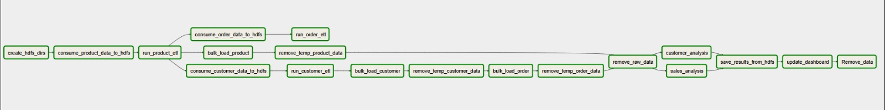
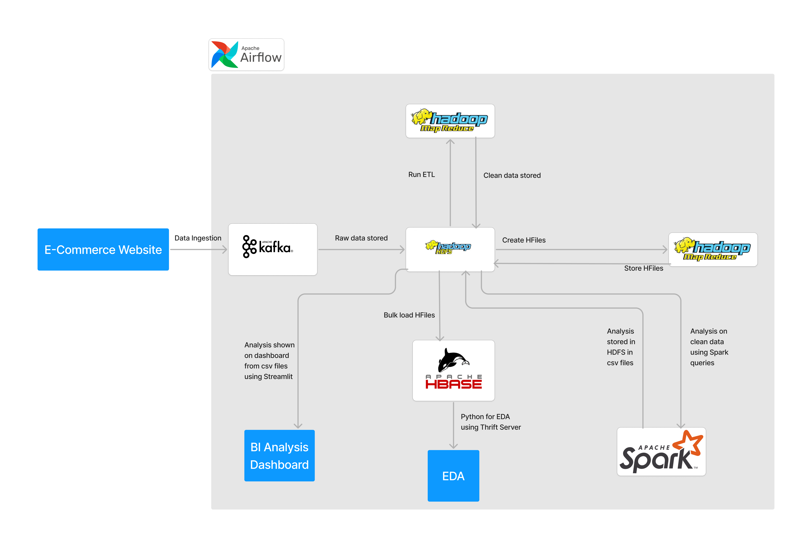

---

## Data Schema

### Customer Table

Column Family: info

| Field        | Data Type |
|--------------|-----------|
| customer_id  | int       |
| name         | string    |
| email        | string    |
| phone        | int       |
| age          | int       |
| gender       | char      |
| location     | string    |

### Product Table

Column Family: details

| Field          | Data Type |
|----------------|-----------|
| product_id     | int       |
| product_name   | string    |
| category       | string    |

Column Family: inventory

| Field          | Data Type |
|----------------|-----------|
| product_id     | int       |
| price          | int       |
| stock_quantity | int       |

### Order Table

Column Family: info

| Field            | Data Type |
|------------------|-----------|
| order_id         | int       |
| customer_id      | int       |
| product_id       | int       |
| quantity         | int       |
| total_amount     | int       |
| transaction_date | date      |
| payment_method   | int       |

---

## Exploratory Data Analysis (EDA)
The following visualizations provide insights into customer demographics and behavior:

### Age Distribution
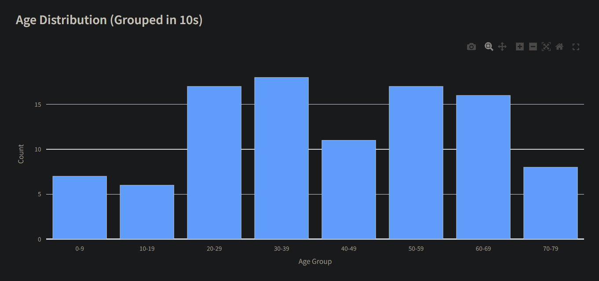

### Location Distribution
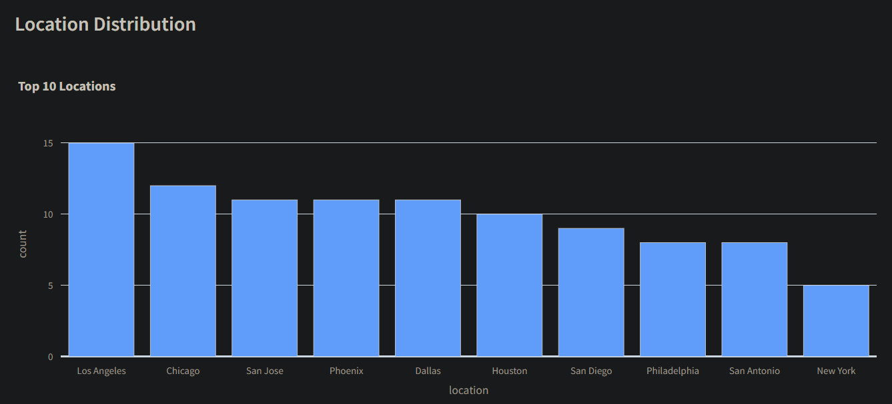

### Category Distribution
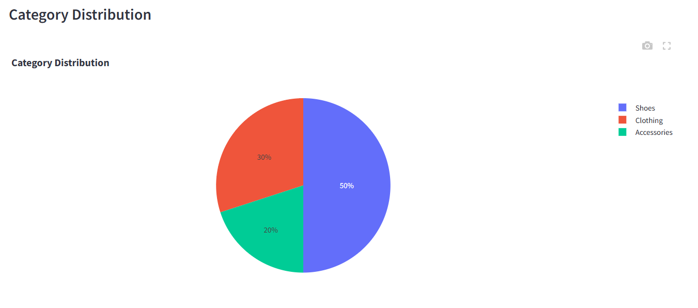

### Payment Method Distribution
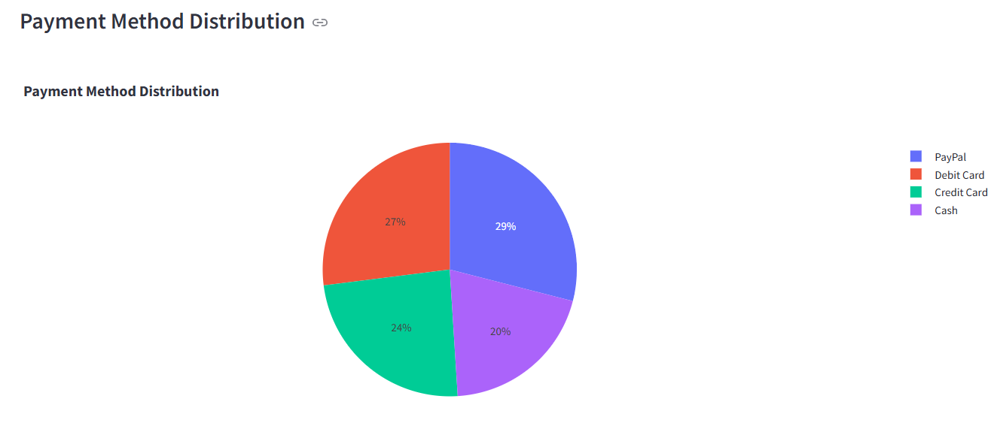

---

## Analysis
The following visualizations provide insights based on data analysis:

### Highest Monthly Sale and Total Revenue
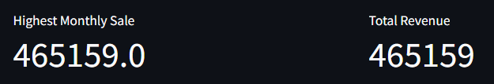

### Age Distribution of Customers
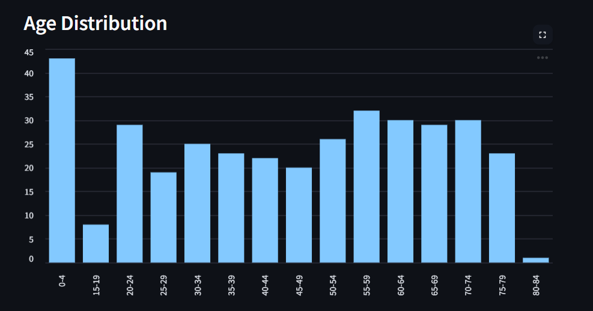

### Gender-wise Sales Distribution
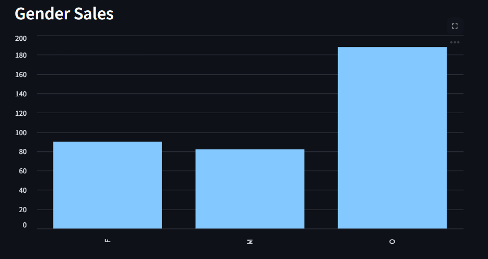

### Customer Count by Location
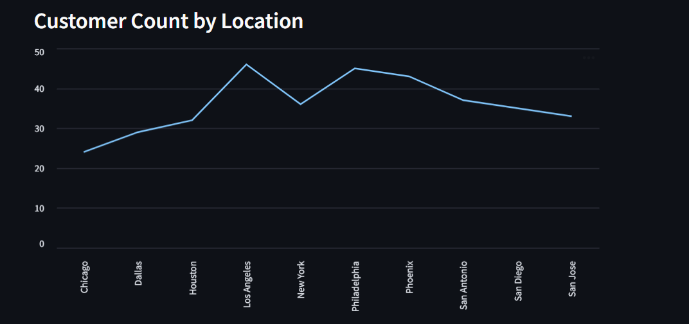

### Top Products by Quantity and Revenue
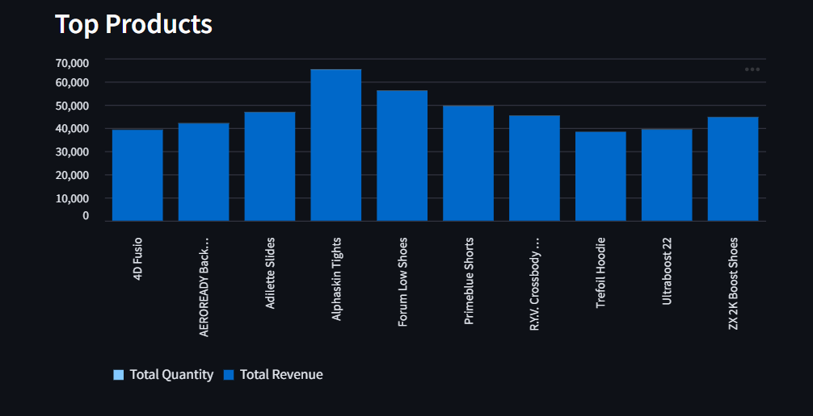

---

## Usage

### Running the DAG
1. Open Airflow UI.
2. Trigger the `bda_pipeline` DAG.

### Viewing Results
Access the Streamlit dashboards at `http://localhost:8501` and `http://localhost:8502`.

---

## Results
The project provides insights into:
- **Top Customers**: Highest revenue generators.
- **Top Products**: Best-selling products.
- **Demographic Insights**: Sales distribution by age, gender, and location.
- **Revenue Analysis**: Total revenue over time.

---

## Setup Instructions
For detailed step-by-step setup instructions, please refer to the [Setup Guide](Code_Files/README.md).

---

## Demo Video
Watch the complete demo of the project in this [video demo](https://www.youtube.com/watch?v=wp9aBacO-QM).

---

## Assumptions and Limitations

### Assumptions
1. Data volume is capped at 5 GB/day for processing.
2. Transaction data is streamed in real-time, while stock updates are batched.

### Limitations
1. Pipeline scalability not tested for datasets exceeding 10GB.
2. Results visualization is dependent on Streamlit.

